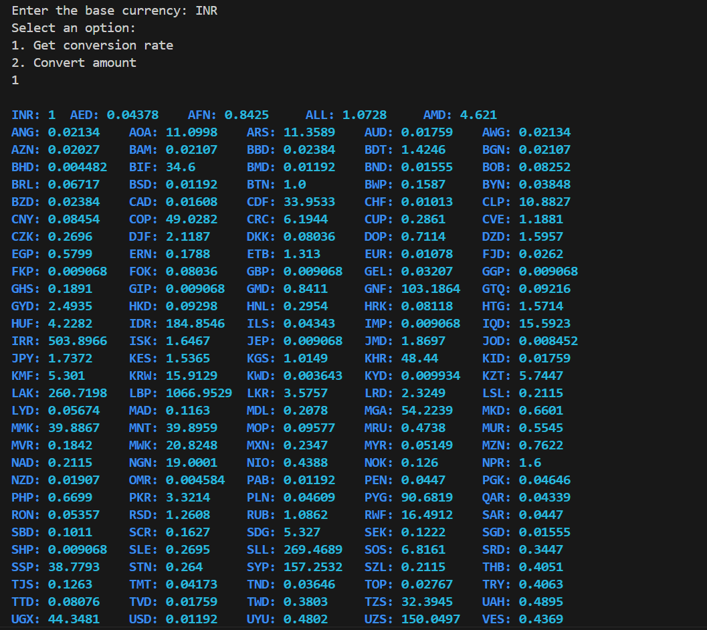

# Terminal Currency Converter
This is a terminal-based currency converter application that allows users to get the latest currency conversion rates and convert amounts between different currencies. The application uses the ExchangeRate-API to fetch the latest exchange rates and caches the results to improve performance.

## Features

- Fetches the latest currency conversion rates.
- Converts amounts between different currencies.
- Caches conversion rates to reduce API calls and improve performance.
- Uses environment variables to securely store API keys.
- Provides a user-friendly terminal interface with rich text formatting.

## Requirements

- Python 3.x
- An Api key from 'exchangerate-api'


## Installation

1. Clone the repository:
    ```sh
    git clone https://github.com/yourusername/terminal-currency-converter.git
    cd terminal-currency-converter
    ```

2. Install the required libraries:
    ```sh
    pip install -r requirements.txt
    ```

3. Create a `.env` file in the root directory and add your ExchangeRate-API key:
    ```plaintext
    API_KEY=your_api_key_here
    ```


## Usage

1. Run the script:
    ```sh
    python currency.py
    ```

2. Follow the prompts in the terminal:
    - Enter the base currency (e.g., USD, EUR).
    - Select an option:
        1. Get conversion rate: Displays the conversion rates for the base currency.
        2. Convert amount: Converts a specified amount from the base currency to another currency.

## Screenshot


## Contact
For any issues contact me at [darshdiv20@gmail.com](mailto:darshdiv20@gmail.com).
